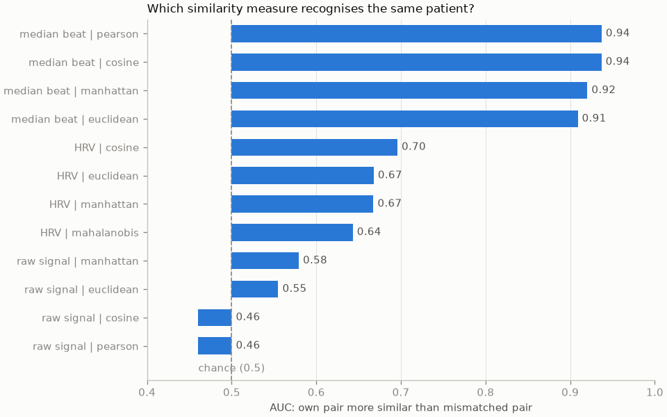
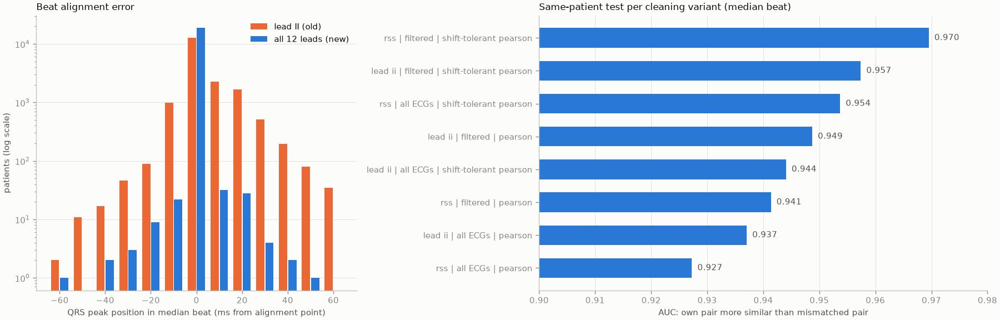
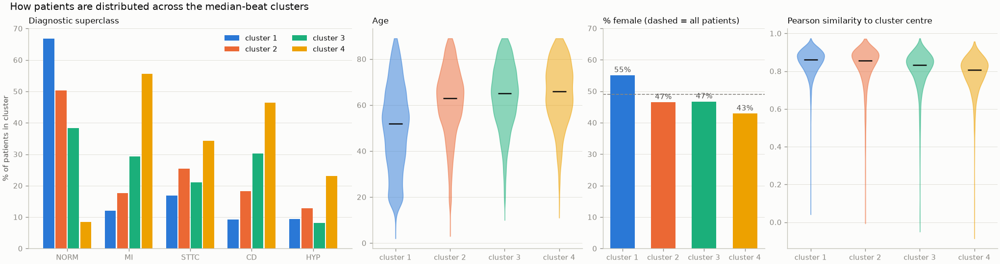
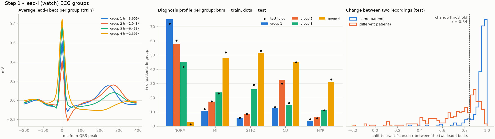
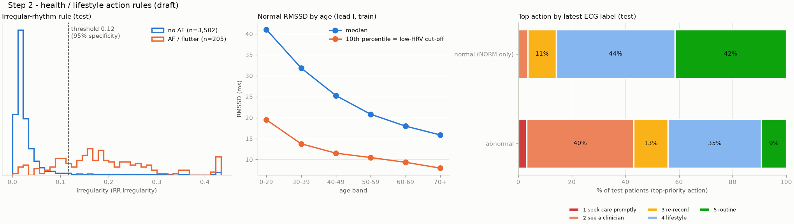
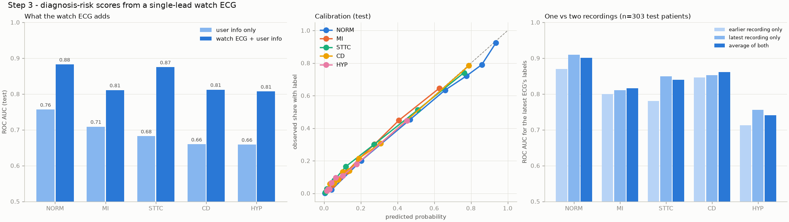
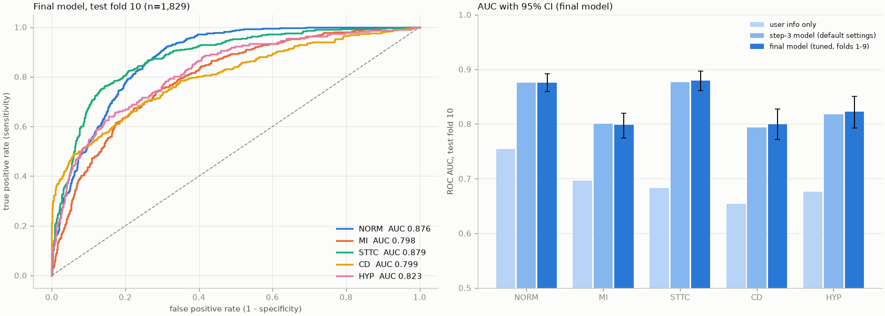

# ECG waveform based services

ECG studies and a watch-ECG recommendation service built on the **PTB-XL** 12-lead ECG dataset.
Each feature or study is added on its own branch (stacked in order, one pull request each).

| # | Branch | Adds |
|---|---|---|
| 1 | `feature/data-loading-hrv` | 100 Hz signal loading, patient metadata, diagnostic superclasses, recording dates, HRV of repeat ECGs |
| 2 | `study/ecg-similarity` | similarity between a patient's two ECGs: raw signal vs median beat vs HRV |
| 3 | `study/cleaning-clustering` | data-cleaning test (beat detection, quality filter) and median-beat clustering of all patients |
| 4 | `feature/watch-step1-groups` | watch (lead I) recommendation, step 1: ECG group + profile, change between two recordings |
| 5 | `feature/watch-step2-actions` | step 2: health / lifestyle action rules |
| 6 | `feature/watch-step3-risk` | step 3: diagnosis-risk scores |
| 7 | `feature/final-model-api` | final train / tune / test, saved model, FastAPI endpoint + tests |
| 8 | `study/qt-interval` | QT / corrected QT study: correlation with age and groups, effect on grouping |

## Setup

```bash
python -m venv .venv && source .venv/bin/activate
pip install -r requirements.txt
```

Download PTB-XL 1.0.3 from PhysioNet (https://physionet.org/content/ptb-xl/1.0.3/) and set `ecg_db_path` in the
"connect dataset" cell of `model/ml.ipynb` to its folder.

## Data and licence

PTB-XL: Wagner, P., Strodthoff, N., Bousseljot, R., Samek, W., & Schaeffter, T. (2022). PTB-XL, a large publicly
available electrocardiography dataset (version 1.0.3). PhysioNet. https://doi.org/10.13026/kfzx-aw45 -
licensed under CC BY 4.0. The dataset itself is not included in this repository.

**Not a medical device.** Outputs describe similarity to PTB-XL patients; they are not a diagnosis.

## 1. Data loading and HRV (`feature/data-loading-hrv`)

`model/ml.ipynb`, first section:
- loads all 21,799 records at **100 Hz** (`records100/`, 1000 samples x 12 leads = 10 s) with `wfdb`
- patient metadata (age with >89 masked as 300 -> NaN, sex, height, weight, ...), `scp_codes` -> diagnostic
  superclasses (NORM, MI, STTC, CD, HYP)
- 2,111 patients have more than one ECG; `strat_fold` keeps each patient in one fold (no leakage)
- recording date/time, visit number, time between a patient's recordings (median 21 days for 2-ECG patients)
- ultra-short HRV (mean HR, SDNN, RMSSD, pNN50) from lead II with NeuroKit2 for the 1,590 two-ECG patients, and the
  change between their two ECGs: no systematic shift, but ~11 ms typical change in SDNN / RMSSD

## 2. ECG similarity study (`study/ecg-similarity`)

Is a patient's own pair of ECGs more similar than two ECGs of different patients (ROC AUC)?

| Compared on | Euclidean | Manhattan | Cosine | Pearson / Mahalanobis |
|---|---|---|---|---|
| Median beat (12 leads) | 0.91 | 0.92 | 0.94 | 0.94 |
| HRV values | 0.67 | 0.67 | 0.70 | 0.64 |
| Raw signal | 0.55 | 0.58 | 0.46 | 0.46 |

The **median beat** works best; the raw signal fails because beats fall at different times in each recording.



## 3. Data cleaning test and median-beat clustering (`study/cleaning-clustering`)

Signal processing moves to `model/watch_pipeline.py` (shared later with the API).
- **Beat detection on all 12 leads** (root-sum-square) instead of lead II: beats misaligned by >= 30 ms drop from
  1,193 to 67 patients
- **Quality filter**: pacemaker, electrode problems, flat lead, amplitude > 10 mV, inconsistent beats (r < 0.8) ->
  642 of 18,869 excluded (3.4%)
- same-patient AUC 0.937 -> **0.970** (all-lead detection + filter + shift-tolerant Pearson)
- k-means on the cleaned median beats (k = 4) of 18,227 patients: groups range from 67% normal ECGs (median age 52)
  to a mostly abnormal group (56% MI, 46% CD); separation is modest (silhouette 0.15-0.23)




## 4. Watch recommendation, step 1: ECG group + profile (`feature/watch-step1-groups`)

Input: user info + **two single-lead (lead I) watch recordings** at any length / sampling rate. Train folds 1-8,
test folds 9-10. `WatchModel.recommend` in `model/watch_pipeline.py`.
- 4 lead-I groups from 75% normal down to 3% normal (STTC 51%, MI 48%); profiles hold on the test folds
- a person's two recordings land in the same group 74% of the time (29% by chance)
- beat-shape change between recordings: AUC 0.90 (threshold = 5th percentile of repeat recordings)
- peers (same group, sex, age +-5) and how common the user's diagnosed label is among them



## 5. Step 2: health / lifestyle actions (`feature/watch-step2-actions`)

14 rules (R1-R14), 5 action levels (seek care promptly, see a clinician, re-record, lifestyle, routine);
thresholds in one `RULES` dict. `WatchModel.health_actions`.
- irregular rhythm (possible AF): AUC 0.94, 76% sensitivity at 95% specificity
- low HRV: below the 10th RMSSD percentile for the age band (normal sinus-rhythm patients)
- test patients with an abnormal latest ECG get a level 1-2 action 12x more often than normal ones (43% vs 3.5%)



## 6. Step 3: diagnosis-risk scores (`feature/watch-step3-risk`)

One gradient-boosting model per superclass on lead-I median beat + rhythm + group similarity + age, sex, height,
weight (the diagnosed label is never an input). `WatchModel.risk_scores` / `recommend_all`.
- macro AUC 0.69 (user info only) -> **0.84** (watch ECG + user info); well calibrated
- with steps 1-3, level 1-2 actions for abnormal test patients rise from 43% to **62%**, still 3.5% for normal ones



## 7. Final model and API (`feature/final-model-api`)

Train folds 1-8, tune on fold 9, refit on 1-9, **test once on fold 10**: macro AUC **0.835 (95% CI 0.823-0.846)**.
The trained bundle is `model/watch_model.joblib`.

```bash
uvicorn main:app
```

- `POST /watch/recommendation` - body: `user` (`age`, `sex`, `height_cm`, `weight_kg`, `diagnosed_label`, all
  optional) and `recording_1` (earlier) / `recording_2` (latest), each `{"signal": [mV, ...], "fs": Hz}`, >= 5 s.
  Returns the prioritised actions, risk scores, group, change check, rhythm and peers.
- `GET /watch/model-info` - version, fold-10 test metrics, rules.

Tests: `python -m pytest` (tests using PTB-XL records are skipped unless `PTBXL_PATH` points to the dataset).


